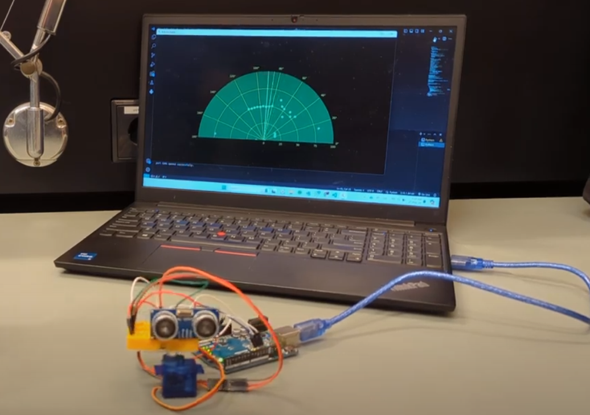

# Arduino-Radar-System
Arduino Radar System with Python implementation

This project aimed to build a radar-like device utilizing various components, such as an Arduino microcontroller, an ultrasonic sensor, and a servo motor. The functionality of the device involved detecting objects within its range, processing the data, and creating a real-time representation of the surroundings.

Materials :

·       Arduino microcontroller
·       Ultrasonic sensor
·       Servo motor
·       Breadboard
·       Jumper wires and necessary cables for power source, etc. 

The experiment involved connecting a servo motor and the ultrasonic sensor to the Arduino microcontroller. The ultrasonic sensor, attached to the servo motor, detects objects nearby by sending out high-frequency sound waves and measuring their bounce-back time. The Arduino processes this information and commands the servo motor to rotate the sensor, scanning the area. Servo motor rotates 180 degrees and back, scanning the surroundings, fetching the data, and then processing in python for every degree. 

Arduino Circuit :

https://www.tinkercad.com/things/gxrcyNVRW4j-radar-system

